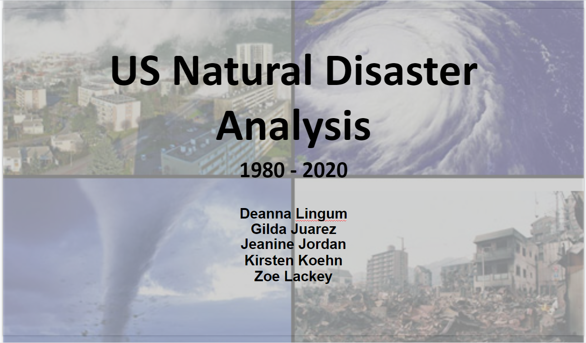
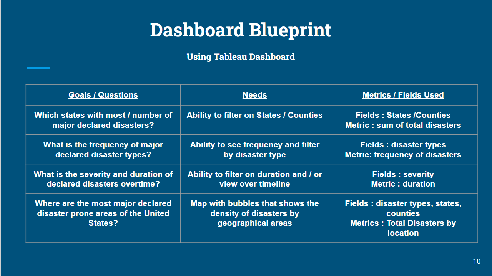

<<<<<<< HEAD
# US_Natural_Disaster_Analysis
 
## Final Project Deliverable 1 - Due November 3rd

* Sourced and presented data to team from Kaggle [FEMA US Natural Disasters 1953 - 2022](https://www.kaggle.com/datasets/headsortails/us-natural-disaster-declarations?resource=download)
* Decided with team this would be a great source to work with, lots of data to glean from and make model predictions, focused on 1980 - 2020.
* Worked with team to assign this week's tasks to each member, Square (Jeanine), Triangle (Deanna), Circle (Kristen), X (all members), Presentation (Gilda & Zoe)
* Discussed with team how to clean data and what fields to drop, what information was relevant for our overall goal.
* Continued research for additional data to expand our project's scope and breadth - trying to see if we can find financial or mortality data for natural disasters.
* Worked with team to map out machine learning and database workflow illustration.
* Created and started overall presentation in [Google Slides](https://docs.google.com/presentation/d/1F354MDtHzS25DnSC8x3uH112HeP4gVl2OF8Yy9zkmKw/edit?usp=sharing) for group final that will be built on over time as we progress with the data.

## Final Project Deliverable 2 - Due November 10th
* Continued progression on data decisions on making it cleaner and better suited for analyis
* Built out presentation for more insight and questions about project itself and the questions we hope to answer.
* IE incident_duration data type was converted from object to integer and AS was removed from the data set 
* Team worked to create database to push to AWS
* Created Dashboard Blue print for presentation and will get it into Tableau now that framework is created

* Update overall presentation in [Google Slides](https://docs.google.com/presentation/d/
=======
>>>>>>> 60cb1e257db26fa65312b8132eea85487736daa1
