# US_Natural_Disaster_Analysis

 ## A thorough analysis studying the correlations and patterns of natural disasters across time and regions in the United States using Python.
 

"Climate is what we expect, weather is what we get." - Mark Twain

### Project Overview 

Natural disasters can be catastrophic to the areas and people who are affected by them. In 2022, surveys from Forbes Home indicated that almost a third of the survey respondents cited worsening weather conditions as a reason for them to move. The same articles stated that nearly two-thirds (62%) of US residents who planned on buying or selling their homes were hesitant to do so in areas at risk of natural disasters, severe temperatures, and rising sea levels. Almost three-quarters (71%) of Gen-Z participants stated they would be apprehensive to move to an area that was at risk of these factors as well. 

The primary goal of this analysis is to observe the overall frequency of major disasters by geographical location at the regional and state level over time, and to create a model that predicts future incidents past on past events. The results produced in this analysis could be impactful when deciding where to relocate within the United States. 

In this project, the following questions will be answered to create an analysis to provide prospective residents of the US with: 

* What are the states with most number of major disasters?
* What are the frequency of the different disaster types?
* What is the severity and duration of events over time?
* What are the most disaster prone areas of the United States?
* How does this information help us to predict the frequency, location and type of disasters yet to come?

The following natural disasters will be studied in this analysis:

* Drought
* Fire
* Freezing
* Hurricanes
* Mud/Landslide
* Severe Ice Storm
* Severe Storms
* Snow
* Tsunami
* Volcano

Overall, could this analysis show potential movers climatic incentives or deterrents to assist them in choosing where in the US to live next?  

### Data Sets

The dataset used during this analysis, us_disaster_declarations.csv, was sourced from Kaggle.com. The content includes a high-level summary of all federally declared disasters by FEMA since 1953 and provides metrics such as the incident type, incident time and duration, geography, and whether programs were implemented. 

### Software

* Python 3..13 (Dependencies: Pandas 1.3.5, SciKit-Learn 1.0, Tensorflow 2.10.0)
* Anaconda 2022.10
* Jupyter Notebook 6.4.12
* Amazon Web Services: RDS, S3
* PostgreSQL 13.7
* pgAdmin 6.8
* ArcGIS Pro 3.0
* Google Presentations

### Assigned Roles for Deliverable 4

* Jeanine - Square: Managed the Github repository & README. Continued to clean and transform the dataset to suit the analysis & created visualizations.  
* Deanna - X: Continued to refine, train and test the machine learning models chosen, created visualizations. 
* Kirsten - X: Tested database integration, continued to enhance database functions, created visualizations using ArcGIS Pro 3.0.
* Gilda - Triangle/Circle: Continued to develop and refine the presentation by working on the storyboard, visualizations and dashboard.
* Zoe Lackey - Triangle/Circle: Continued to develop and refine the presentation by working on the storyboard, visualizations and dashboard.

### Data Cleaning & Transforming Process

1.	The original data set, us_disaster_declarations.csv, was loaded into Jupyter Notebook and filtered to only show the incidents occurring from 1980 to 2020 using Pandas. The clean_df.csv was produced from these actions and then used to create the nd_df data frame. From this point, columns housing data that was inconsequential to the analysis were removed from the data set.

2.	Outlier incident types that were at risk of skewing the results in this analysis, such as the COVID-19 pandemic, were removed from the dataset.

3.	The values in the US territories, American Samoa, Guam, Northern Mariana Islands, Puerto Rico and U.S. Virgin Islands, were removed from the dataset to avoid skewing due to these areas having disastrous weather conditions at a higher frequency and to focus more on the data for the mainland US. 

4.	The date strings were changed into proper date format.

5. Duplicate incident reports were removed from the data set. 

6.	A new column was created to house the numeric month value each incident began so analysis could be conducted on what time of the year incidents occurred. 

7.	A new column was created, incident_duration, by subtracting the incident_begin_date column from the incident_end_date column This allows analysis to be conducted on the duration of each incident. The data type of the column was then changed from an object to an integer. 

8.	All zero values in the incident duration column represent incidents that were less than a day in length and were changed to the number 1 in the data set. 

9.	A new column was created to house the year each incident began. 

10.	To conduct analysis on the US regions the disasters occurred in, a dictionary was created that contained the state abbreviations as well as their respective regions. The function “get_region” was created using .apply() to match the region to the states in a new column called “regions”. 

11.	A new column was created that combined the values from all four “program_declared” columns in the dataset. 

12.	A new column was created that housed the season each incident occured within. 

13. A new column was created that housed the numeric group for the seasons.

14. A new column column was created that housed the numeric group for the regions.

15.	Additional columns that were proven to be obsolete to this analysis were dropped from the data set. 

16.	A new data frame was created to house the disaster number, incident type, incident month, incident begin year and incident duration. 

17.	A new data frame was created to house the disaster number, incident type, designated area, state, region and programs declared columns. 

18. The transformed nd_df.csv was then exported into the Resources folder of the repository alongside the two new data frames, incident_declaration.csv and incident_duration.csv. 

### Machine Learning Model & Statistical Analysis:

The following algorithms will be tested and utilized during this analysis:

##### ARIMA (AutoRegressive Integrated Moving Average):
* ARIMA is a forecasting algorithm that predicts a time series based on its own past values. ARIMA models use differencing to convert a non-stationary time series into stationary ones, predicting future values from historical data. Predicted values are a weighted linear combination of past values. Uses past values and lagged forecast errors to predict.

##### ARMA (Autoregressive Moving Average):
* ARMA is a forecasting algorithm that predicts time series based on its own past values. Uses past values, differencing (difference of consecutive values), and lagged forecast errors to predict.

###### Pros:
* Performs well on short term forecasts.
* Easy to implement. 

###### Cons: 
* Subjectivity involved in determining order of the model.
* Poorer performance for long term forecasts.

##### Preliminary data preprocessing:

* Sum incidents by year
* Create region and state dataframes.
     
##### Data Train and Test Split:
* Train = Incidents in years before 2015
* Test = Incidents in years from 2015 and on (2020)
     
##### Root Mean Squared Error(RMSE)
* The standard deviation of the prediction errors and will be used to determine how accurately the model prediction fits the test. The lower the RMSE, the better the fit.
     
### Top 5 States: time series and preditions using ARIMA (AutoRegressive Integrated Moving Average):

#### Alabama

* The ARMA prediction stays the same at around 1.9 disasters with no variation from 2015 to 2020.
The fit of the model is shown with an RMSE of 1.106.

* The ARIMA prediction is decreasing from 2 to 1.9 disasters with little variation from 2015 to 2020. (Order parameters: (2, 1, 4))
The fit of the model is shown to be better with an RMSE of 1.010.

##### Predictions:
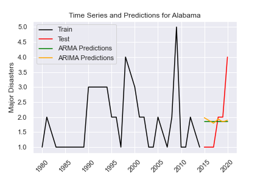

##### Time Series:
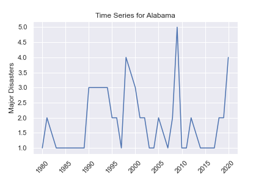

##### Alabama Root Mean Squared Error(RMSE)
* ARMA RMSE:  1.1057830551149126
* ARIMA RMSE:  1.0995657532866305

#### California

* The ARMA prediction is staying the same at approximately 1.7 disasters with no variation from 2015 to 2020.
The fit of the model is shown with an RMSE of 2.810.

* The ARIMA prediction is increasing from approximately 2 to 4 disasters with little variation from 2015 to 2020. (Order parameters: (1, 4, 4))
The fit of the model is shown to be better with an RMSE of 2.554.

##### Predictons:

##### Time Series
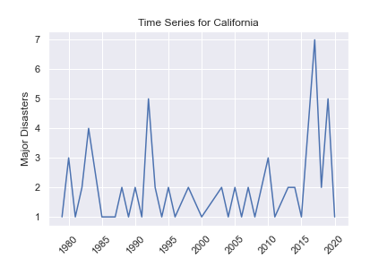

##### California Root Mean Squared Error(RMSE)
* ARMA RMSE:  2.8095734822781377
* ARIMA RMSE: 2.5539554091774845

#### Florida

* The ARMA prediction stays the same at around 2 disasters with no variation from 2015 to 2020.
The fit of the model is shown with an RMSE of 0.725.

* The ARIMA prediction is decreasing from approximately 1.9 disasters to 1 disaster, increasing from 1.9 to 2 disasters at the start before decreasing with little variation from 2015 to 2020. (Order parameters: (6, 3, 2))
The fit of the model is shown to be better with an RMSE of 0.117.

##### Predictons:

##### Time Series
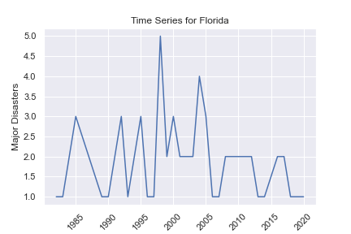

##### Florida Root Mean Squared Error(RMSE)
* ARMA RMSE:  0.7251698748663542
* ARIMA RMSE:  0.11720733219450215

#### Oklaholma

* The ARMA prediction is decreasing from approximately 2.5 to 2 disasters with no variation from 2015 to 2020.
The fit of the model is shown to be better than the ARIMA model with an RMSE of 1.004.

* The ARIMA prediction is decreasing from approximately 2.2 to 0.8 disasters with little variation from 2015 to 2020. (Order parameters: (1, 4, 2))
The fit of the model is shown with an RMSE of 1.347.

##### Predictons:

##### Time Series
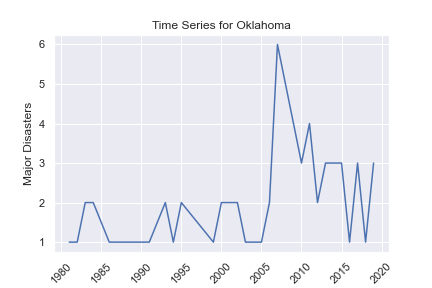

##### Oklaholma Root Mean Squared Error(RMSE)
* ARMA RMSE:  1.0039510615790976
* ARIMA RMSE:  1.346969912321104

#### Texas

* The ARMA prediction is staying the same at approximately 1.9 disasters with no variation from 2015 to 2020.
The fit of the model is shown with an RMSE of 0.801.

* The ARIMA prediction is decreasing from approximately 2.5 to 2 disasters, with a dip in the middle to 1.5 disasters, from 2015 to 2020. (Order parameters: (3, 1, 4))
The fit of the model is shown to be better with an RMSE of 0.714.

##### Predictons:
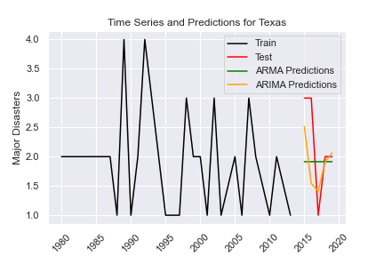

##### Time Series

##### Texas Root Mean Squared Error(RMSE)
* ARMA RMSE:  0.8010410159381002
* ARIMA RMSE:  0.7136239431177938

### US Regions: time series and preditions using ARIMA (AutoRegressive Integrated Moving Average):

#### Midwest

* The ARMA prediction is decreasing approximately 15.5 to 15 disasters with no variation from 2015 to 2020.
The fit of the model is shown with an RMSE of 6.957.

* The ARIMA prediction is decreasing from approximately 13 to 10 disasters with high variation from 2015 to 2020. (Order parameters: (2, 3, 5))
The fit of the model is shown to be better with an RMSE of 5.582.

##### Midwest Prediction

##### Midwest Time Series

##### Midwest Root Mean Squared Error(RMSE)
* ARMA RMSE:  6.957494778174539
* ARIMA RMSE:  5.582063919229161

#### Southeast

* The ARMA prediction is decreasing from approximately 14 to 13 disasters with no variation from 2015 to 2020.
The fit of the model is shown with an RMSE of 3.735.

* The ARIMA prediction is decreasing from approximately 20 to 15 disasters with some variation from 2015 to 2020.  (Order parameters: (1, 1, 5))
The fit of the model is shown to be better with an RMSE of 2.154.

##### Southeast Prediction
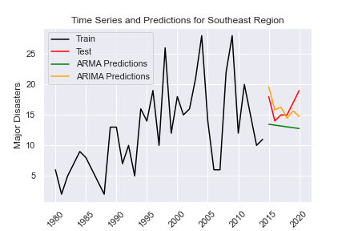

##### Southeast Time Series

##### Southeast Root Mean Squared Error(RMSE)
* ARMA RMSE:  3.735358277541541
* ARIMA RMSE:  2.1542422431320745

#### Northeast

* The ARMA prediction is decreasing from approximately 12 to 11 disasters with no variation from 2015 to 2020.
The fit of the model is shown with an RMSE of 4.741.

* The ARIMA prediction is decreasing from approximately 9 to 7 disasters with little variation from 2015 to 2020. (Order parameters: (2, 3, 2))
The fit of the model is shown to be better with an RMSE of 3.087.

##### Northeast Prediction
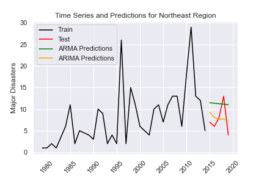

##### Northeast Time Series

##### Northeast Root Mean Squared Error(RMSE)
* ARMA RMSE:  4.741406279911125
* ARIMA RMSE: 3.087479272233823

#### Southwest

* The ARMA prediction is very slightly decreasing at around 5.5 disasters with no variation from 2015 to 2020.
The fit of the model is shown to be better than the ARIMA model with an RMSE of 0.801.

* The ARIMA prediction is very slightly increasing at around 5.5  disasters with very little variation from 2015 to 2020. (Order parameters: (1, 1, 1))
The fit of the model is shown with an RMSE of 0.846.

##### Southwest Prediction
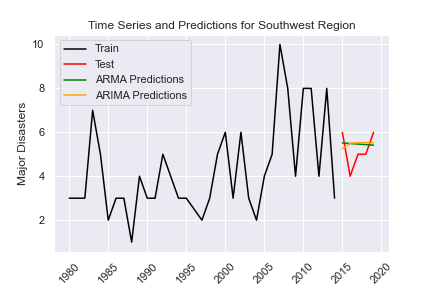

##### Southwest Time Series

##### Southwest Root Mean Squared Error(RMSE)
* ARMA RMSE:  0.8008248266417702
* ARIMA RMSE: 0.8456739625167564

#### West

* The ARMA prediction is increasing from approximately 9 to 10 disasters with high variation from 2015 to 2020.
The fit of the model is shown to be better than the ARIMA model with an RMSE of 4.957.

* The ARIMA prediction is increasing from approximately 10 to 11 disasters with no variation from 2015 to 2020. (Order parameters: (1, 3, 3))
The fit of the model is shown with an RMSE of 5.342.

##### West Prediction
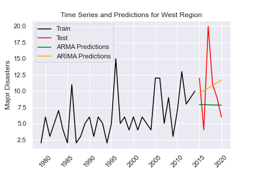

##### West Time Series

##### West Root Mean Squared Error(RMSE)
* ARMA RMSE:  4.95668562717005
* ARIMA RMSE:  5.342802335311312

### Database Workflow:

* Raw data was imported from source into Postgres database
* Dataframes from Python/Pandas were imported into database
* Final cleaned joined table was created in Postgres
* Data was uploaded to AWS to be available for Machine Learning and Visualization
* ERD was created

##### Database:

##### ERD:

### Visualization Workflow:

Tableau and ArcGIS Pro 3.0 will be used to create visualizations for this presentation.  Visualizations will include USA maps and choropleth maps and interpretations of top states divided up by counties (California and Texas) will be used to give further analysis in the presentation. 

##### ArcGIS Pro 3.0 video visualization of the number of incidents in each state by year:
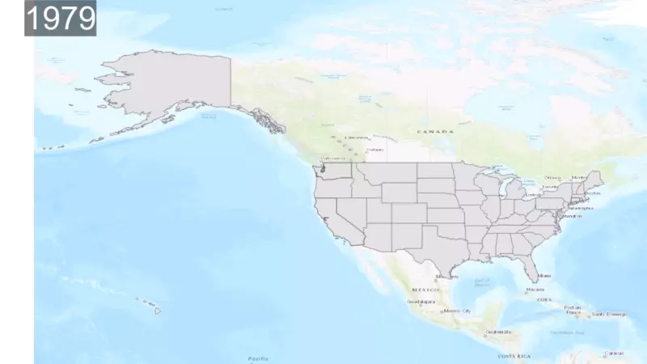

##### ArcGIS Pro 3.0 video visualization of the number of incidents in each region by year:

#### A link to the Tableau dashboard is below:
https://public.tableau.com/views/US_Natural_Disaster_Analysis/Story1?:language=en-US&publish=yes&:display_count=n&:origin=viz_share_link

A link to the second Tableau dashboard created is below:
https://public.tableau.com/views/NaturalDisasters_16689905936500/Dashboard1?:language=en-US&:display_count=n&:origin=viz_share_link

##### Area chart displaying total disasters over time, from 1980-2020, by disaster type:

##### Map of the US (excluding territories and commonwealths) displaying total recorded disasters by state:

##### Stacked bar chart displaying the total recorded incidents by state and incident type:

##### Density chart displaying the total number of incidents by incident type and month of occurrence:
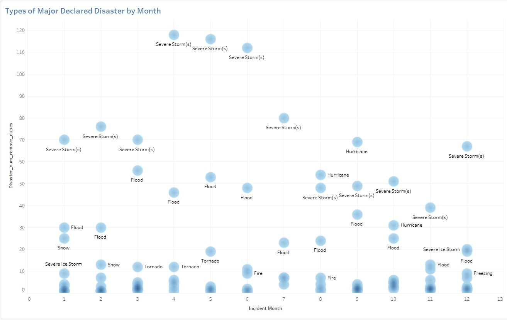

##### Snapshot of the Tableau dashboard:
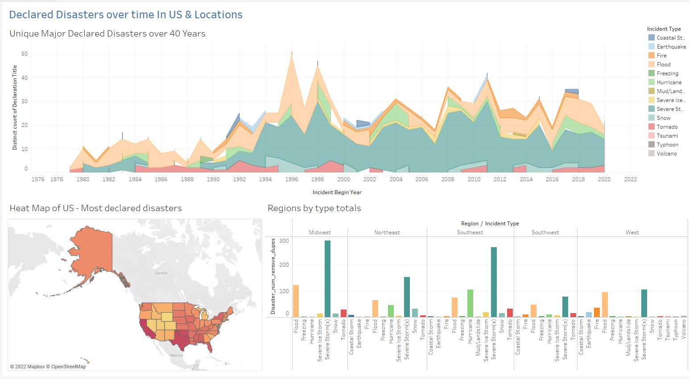

##### Snapshot of the second Tableau dashboard:

Additional visualizations will be used to analyze temporal, seasonal data to identify peak seasons for certain kinds of natural disasters in the top 10 states that are proven to be hot spots as well as the states with the least disasters during those seasons. These will be used to give insights to clients about potential states where they can pass pleasant seasons if they live somewhere with a high number of natural disasters. 

#### Visualization Dashboard overview and proposal link below:
https://docs.google.com/presentation/d/1hPUla483eCj7iZsOuy-jvjMu_lQ1LE9z70fLbF-9IEc/edit#slide=id.g1f88252dc4_0_162

### Presentation

The Google presentation is in progress (link below). The presentation was edited for grammar as well as style in order to rework the language to suit the purpose of a professional presentation to a client. The presentation was edited to include more visuals, more succinct language, and speaker notes. 

https://docs.google.com/presentation/d/1F354MDtHzS25DnSC8x3uH112HeP4gVl2OF8Yy9zkmKw/edit#slide=id.p

A mock final presentation was conducted with the participants of this analysis and uploaded to Youtube:

https://www.youtube.com/watch?v=laYOgs7zY-o

##### Speakers & Topics:
* Gilda: introductory preamble, explanation of purpose of analysis and dataset
* Jeanine: data cleaning/preprocessing
* Deanna: preprocessing/machine learning model
* Kirsten: database workflow and ArcGIS visualizations
* Zoe: Tabelau presentation, summary of findings

### Summary and Results
* California had the most declared disasters overall, with 67 nationally declared natural disasters.
* There has been an overall increase in events over time as seen in the time series maps. This indicates an increasing level of severity of natural events.
* The most disasters happened in the Midwest and Southeast regions. 
* We can use trend data from the data in order to forecast what types of disasters will most likely occur, where they may occur, and the time of year.
* From the forecasting models, California and the West region are predicted to be increasing in the amount of major disasters for the short-term future, with the rest of the states and regions forecasted to be either staying the same or decreasing.

### Recommendations
Our recommendation to improve this analysis would be to add a secondary dataset for a comparative analysis, such as monetary impact, population impact or climate change. Seasonal ARIMA and other models for time series and forecasting should be explored, as well as programs declared in relation to other provided variables in the dataset. 
