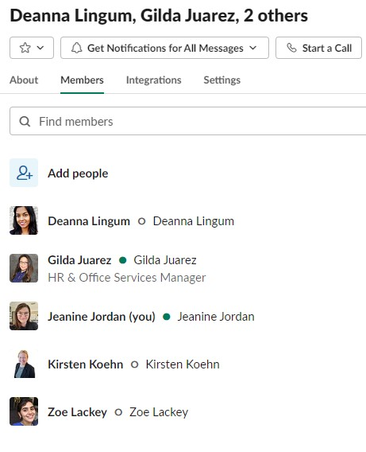

# US_Natural_Disaster_Analysis
 
 ## A thorough analyisis studying the correlations and patterns of natural disasters across time and regions in the United States using Python.
 

Our team has selected to use FEMA US Disaster Data for all 50 states. The forty years of focus include 1980 - 2020 and details on major disaster events such as:

* Drought
* Fire
* Freezing
* Hurricanes
* Mud/Landslide
* Severe Ice Storm
* Severe Storms
* Snow
* Tsunami
* Volcano

Natural disasters can be catastrophic to the areas that are affected.

Our primary goal in selecting the US Natural Disaster dataset was to observe the overall frequency of major disasters by location, County & State.  This information can be useful when trying to relocate to the United States. Additionally, we would like to model the data to potentially predict events in areas based on past events.

In this project, the following questions will be answered to create an analysis to provide prospective residents of the US with: 

* What are the states with most number of natural disasters?
* What are the frequency of the different disaster types?
* What is the severity and duration of events over time?
* What are the most disaster prone areas of the United States?
* How does this information help us to predict the frequency, location and frequency of distasters yet to come?

Overall, could the results produced in this analysis affect the desirability of the affected areas?

Thus far, the following objectives have been completed:

### Roles for Deliverable week 1 have been assigned as follows:

* Jeanine - Square: The team member in the square role will be responsible for the repository.
* Deanna - Triangle: The member in the triangle role will create a mockup of a machine learning model. This can even be a diagram that explains how it will work concurrently with the rest of the project steps.
* Kristen - Circle: The member in the circle role will create a mockup of a database with a set of sample data, or even fabricated data. This will ensure the database will work seamlessly with the rest of the project.
* All / Zoe Lackey -X: The member in the X role will decide which technologies will be used for each step of the project.
Presentation - Gilda

### Contact information has been exchanged and a Slack group created for the team to communicate within: 

### A data set has been selected from Kaggle.com (note: a second data set is being selected to allow for additional metrics to be analyzed):

### The Github repository has been created with a branch assigned to all team members:

### The data has been cleaned using Pandas and Jupyter Notebook (see the cleaning.ipynb file in the repository or the clean_data.csv):

### The Google presentation has been created and is in progress:

https://docs.google.com/presentation/d/1F354MDtHzS25DnSC8x3uH112HeP4gVl2OF8Yy9zkmKw/edit?usp=sharing

### A tentative workflow model has been created:

#### Machine Learning Workflow:

* The data has been cleaned using Pandas in Jupyter Lab and will be pre-processed using the same tools. 
* Scikit-Learn will be used to import the machine learning algorithms that will be used to classify and predict the data in this analysis. 
* StandardScaler and MinMax Scaler will be used to standardize and scale the data. 
* The K-Means algorithm will be used to cluster the data.
* The Random Forest algorithm will be used to classify the data and make the predictions. 

#### Visiaulization Workflow:

* A database created using pgAdmin will be used to create DataFrames that will be used during this presentation. 
* Tableau will be used to create visualizations for this presentation

