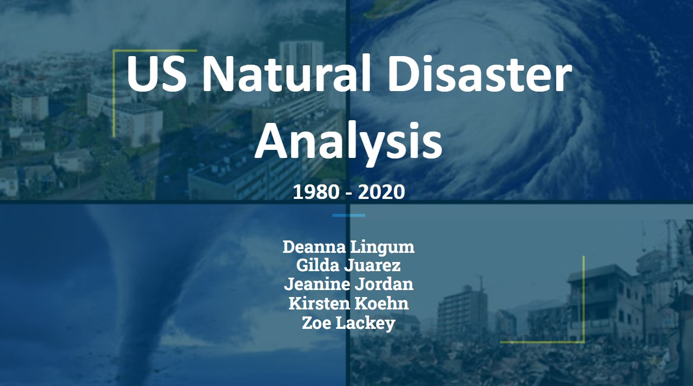
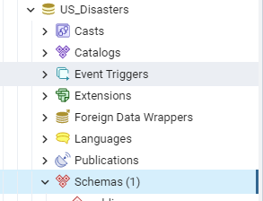
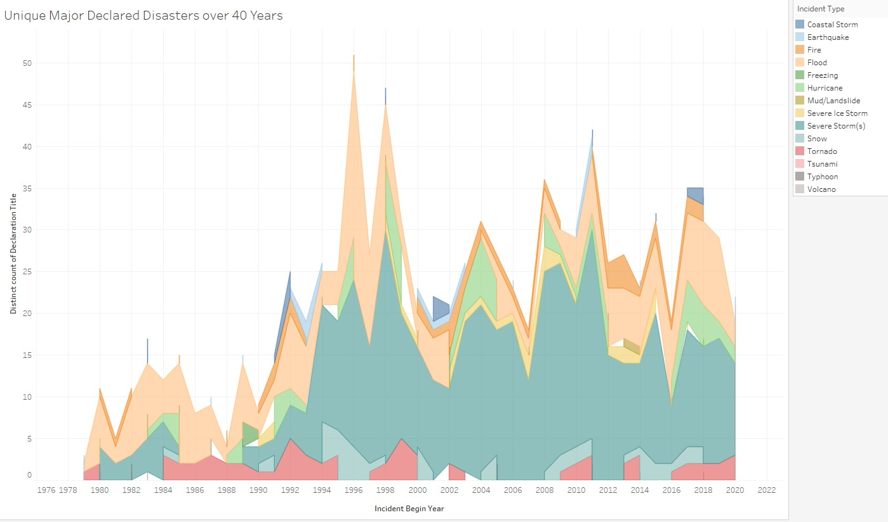

# US_Natural_Disaster_Analysis

 ## A thorough analysis studying the correlations and patterns of natural disasters across time and regions in the United States using Python.
 

### Project Overview 

Natural disasters can be catastrophic to the areas that are affected by them. The primary goal of this analysis is to observe the overall frequency of major disasters by geographical location at the county and state level over time, and to create a model that predicts future incidents past on past events. The results produced in this analysis could be impactful when deciding where to relocate within the United States. 

In this project, the following questions will be answered to create an analysis to provide prospective residents of the US with: 

* What are the states with most number of natural disasters?
* What are the frequency of the different disaster types?
* What is the severity and duration of events over time?
* What are the most disaster prone areas of the United States?
* How does this information help us to predict the frequency, location and type of disasters yet to come?

The following natural disasters will be studied in this analysis:

* Drought
* Fire
* Freezing
* Hurricanes
* Mud/Landslide
* Severe Ice Storm
* Severe Storms
* Snow
* Tsunami
* Volcano

Overall, could the results produced in this analysis affect the desirability of the affected areas?

### Data Sets

The dataset used during this analysis, us_disaster_declarations.csv, was sourced from Kaggle.com. The content includes a high-level summary of all federally declared disasters by FEMA since 1953 and provides metrics such as the incident type, incident time and duration, geography, and whether programs were implemented. 

### Software

* Python 3..13 (Dependencies: Pandas 1.3.5, SciKit-Learn 1.0, Tensorflow 2.10.0)
* Anaconda 2022.10
* Jupyter Notebook 6.4.12
* Amazon Web Services: RDS, S3
* PostgreSQL 13.7
* pgAdmin 6.8
* Ark

### Assigned Roles for Deliverable 2

* Jeanine - Circle/X: Continuing to refine the analysis by cleaning and transforming the dataset to suit the analysis. Managed the Github page & README. 
* Deanna - Square: Focusing on the machine learning model. Building off of the preliminary model built in the first segment, continue to refine, train, and test the model. Documenting how it ties into the project. 
* Kristen - Triangle: Upscaling the project's database. Created the mockup database and is now leveling it to use the full static dataset. Making sure the database is integrated fully and that it interfaces with the project. Created a join from two tables and a connection string linking the code to the database. 
* Gilda - X: Create a storyboard of a dashboard that will be used to display the data findings.
* Zoe Lackey - Circle: Continuing to refine the analysis & is generating images to use in the presentation and with the dashboard. 

### Data Cleaning & Transforming Process

1.	The original data set, us_disaster_declarations.csv, was loaded into Jupyter Notebook and filtered to only show the incidents occurring from 1980 to 2020 using Pandas. The clean_df.csv was produced from these actions and then used to create the nd_df data frame. From this point, columns housing data that was inconsequential to the analysis were removed from the data set.

2.	Outlier incident types that were at risk of skewing the results in this analysis, such as the COVID-19 pandemic, were removed from the dataset.

3.	The values in the US territories, American Samoa, Guam, Northern Mariana Islands, Puerto Rico and U.S. Virgin Islands, were removed from the dataset to avoid skewing due to these areas having disastrous weather conditions at a higher frequency and to focus more on the data for the mainland US. 

4.	The date strings were changed into proper date format.

5.	A new column was created to house the numeric month value each incident began so analysis could be conducted on what time of the year incidents occurred. 

6.	A new column was created, incident_duration, by subtracting the incident_begin_date column from the incident_end_date column This allows analysis to be conducted on the duration of each incident. The data type of the column was then changed from an object to an integer. 

7.	All zero values in the incident duration column represent incidents that were less than a day in length and were changed to the number 1 in the data set. 

8.	A new column was created to house the year each incident began. 

9.	To conduct analysis on the US regions the disasters occurred in, a dictionary was created that contained the state abbreviations as well as their respective regions. The function “get_region” was created using .apply() to match the region to the states in a new column called “regions”. 

10.	A new column was created that combined the values from all four “program_declared” columns in the dataset. 

11.	Additional columns that were proven to be obsolete to this analysis were dropped from the data set. 

12.	A new data frame was created to house the disaster number, incident type, incident month, incident begin year and incident duration. 

13.	A new data frame was created to house the disaster number, incident type, designated area, state, region and programs declared columns. 

14. The transformed nd_df.csv was then exported into the Resources folder of the repository alongside the two new data frames, incident_declaration.csv and incident_duration.csv. 

### Machine Learning Model:

The following algorithms will be tested and utilized during this analysis:

##### KMeans: 
* Pros: Easy implementation and interpretation, guarantees convergence.
* Cons: Trouble clustering data where clusters are of varying sizes and density

##### KNN (Nearest Neighbors):
* Pros: Simple, no assumptions
* Cons: Slow algorithm

##### Linear Regression:
* Pros: Extrapolation beyond dataset, handles overfitting well
* Cons: Prone to multicollinearity

##### Preliminary data preprocessing:

##### OneHotEncoder on:
     * Incident Type
     * Region
     * State
     
##### Preliminary Features:
     * Incident Type
     * Incident Month
     * Incident Year
     * Incident Duration

##### Data train and test split:
     * X = features without incident duration
     * Y = incident duration

### Database Workflow:

* A database created using pgAdmin and PostGreSQL.
* An ERD was created and updated.
* All data was loaded into an AWS server.

##### Screenshot of database in pgAdmin:

##### ERD:

### Visualization Workflow:

Tableau and Ark will be used to create visualizations for this presentation.  Visualizations will include USA maps and choropleth maps and interpretations of top states divided up by counties (California and Texas) will be used to give further analysis in the presentation. 

#### A link to the Tableau dashboard in progress is below:
https://public.tableau.com/app/profile/jeanine.jordan/viz/USNaturalDisasters1980-2020/Dashboard1?publish=yes

##### Area chart displaying total disasters over time, from 1980-2020, by disaster type:

##### Map of the mainland US displaying total recorded disasters by state:

##### Bar chart displaying the total recorded incidents by state and incident type:

##### Stacked bar chart displaying the total number of incidents by incident type and month of occurrance:

##### Snapshot of the Tableau dashboard in progress:

Additional visualizations will be used to analyze temporal, seasonal data to identify peak seasons for certain kinds of natural disasters in the top 10 states that are proven to be hot spots as well as the states with the least disasters during those seasons. These will be used to give insights to clients about potential states where they can pass pleasant seasons if they live somewhere with a high amount of natural disasters. 

#### Visualization Dashboard overview and proposal link below:
https://docs.google.com/presentation/d/1hPUla483eCj7iZsOuy-jvjMu_lQ1LE9z70fLbF-9IEc/edit#slide=id.g1f88252dc4_0_162

### Presentation

The Google presentation is in progress (link below). The presentation was edited for grammar as well as style in order to rework the language to suit the purpose of a porfessional presentation to a client. The presentation was edited to include more visuals, more succinct language, and speaker notes. 

https://docs.google.com/presentation/d/1F354MDtHzS25DnSC8x3uH112HeP4gVl2OF8Yy9zkmKw/edit?usp=sharing
